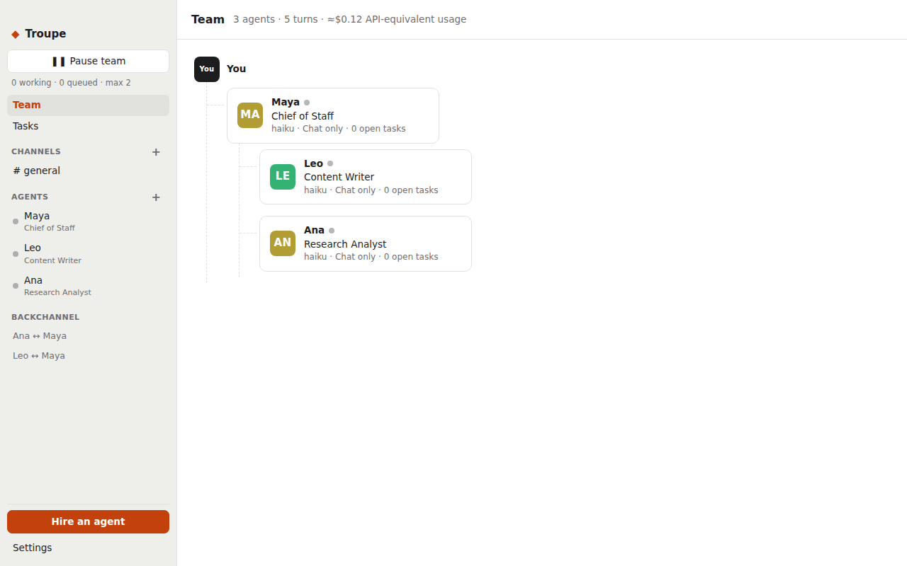
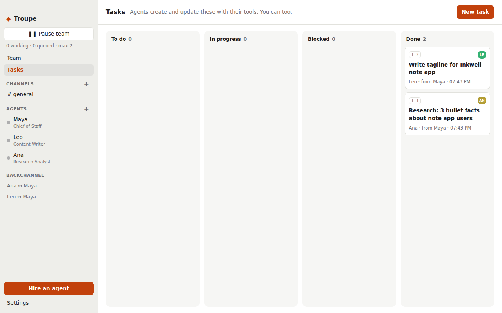

# Troupe

Hire a team of Claude agents, give each one a role and responsibilities, and let them message each other, delegate tasks and report back to you. Troupe is a macOS app that runs on your **Claude Pro/Max subscription** through the official Claude Code CLI. It doesn't use an API key.


| Org chart | Task board | Live activity |
|---|---|---|
|  |  |  |

See [PLAN.md](PLAN.md) for the design and roadmap.

## Requirements

- macOS (also runs on Linux; Windows is untested)
- Node.js 20+
- [Claude Code](https://docs.claude.com/en/docs/claude-code) installed and logged in with your subscription:
  ```sh
  curl -fsSL https://claude.ai/install.sh | bash
  claude          # then /login and pick your Claude account
  ```

## Run it

```sh
cd troupe
npm install
npm run dev          # build + launch
```

To build a `.dmg` / `.app`:

```sh
npm run dist:mac     # output in release/ via electron-builder (unsigned)
```

## Using it

1. **Hire** a *Chief of Staff* first, then specialists (Engineer, Researcher, Writer, Reviewer…) who **report to** them.
2. **DM** the Chief of Staff with a goal. They break it into tasks, delegate with `create_task`, and message you when it's done.
3. Watch the work happen: **Activity** shows each agent's tool calls live, **Backchannel** shows their private DMs, and **Tasks** is the shared board.
4. Use **#general** or your own channels for group work. A message from you wakes everyone in the channel. Agents only wake teammates they `@mention`.

### Controls that protect your usage limits

- **Agents working at once** (default 2): all agents share your subscription's limits.
- **Loop limit** (default 8 hops): stops agents messaging each other indefinitely.
- **Pause team**, **Stop** on a running agent, and **Pause** per agent.
- When a turn fails (e.g. a usage limit), the agent is **put on hold** with its messages kept. Press **Resume** when you're ready.
- **Heartbeat** is off by default. Turn it on per agent to have them check their tasks on a schedule.

### Permissions

Each agent has a preset: **Chat only** (no file or web access), **Research** (web and read files), **Builder** (edit files, a few safe shell commands), or **Full autonomy** (skips all permission checks; only use it in a throwaway folder). By default agents work in a shared workspace folder that you can change in Settings, or you can give an agent its own directory.

## Development

```sh
npm run typecheck
npm test             # orchestrator unit tests (fake Claude runner)
npm run e2e          # real end-to-end run with two agents on Haiku (uses a little of your usage)
```

Layout:

```
src/core/orchestrator.ts   routing, inbox, scheduler, loop guard, agent tools
src/core/claudeRunner.ts   spawns `claude -p`, parses stream-json, PATH discovery
src/core/bridge.ts         localhost endpoint the MCP server calls
src/core/prompts.ts        system prompt + per-turn wake-up prompt
src/mcp/server.ts          stdio MCP server each agent loads (mcp__troupe__*)
src/main/                  Electron main + preload
src/renderer/              React UI
```

App data lives in `~/Library/Application Support/Troupe/state.json`. Each agent's conversation history is a normal Claude Code session.

## A note on terms

Troupe automates the official `claude` CLI on your own machine with your own login, the same as running `claude -p` from a script. Don't host it as a service for other people on your subscription. Review Anthropic's current terms before you distribute it.
