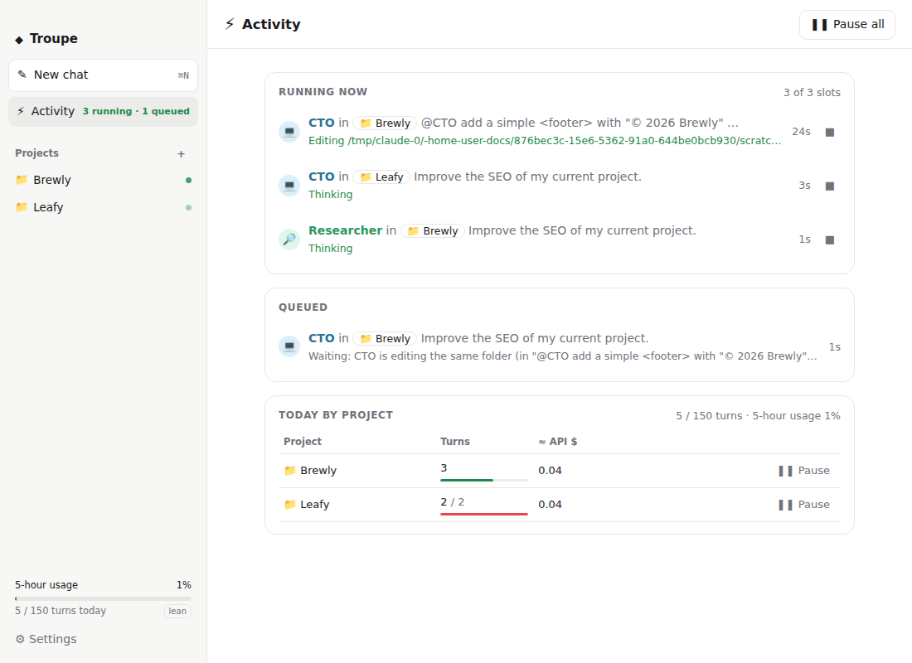
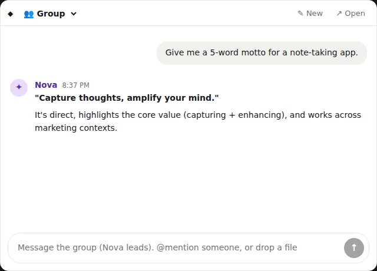
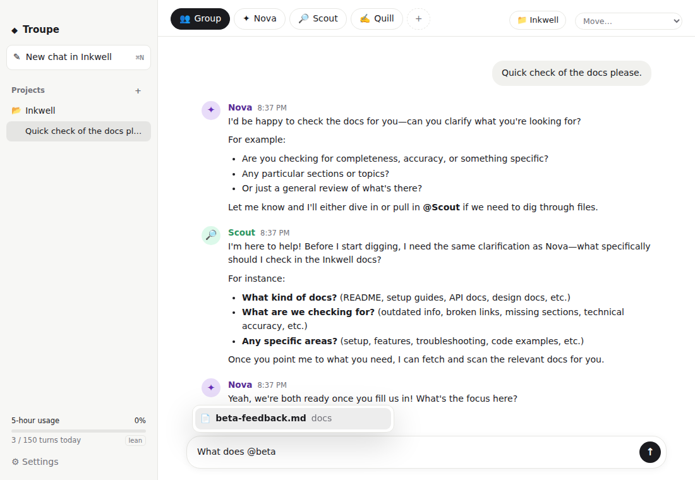
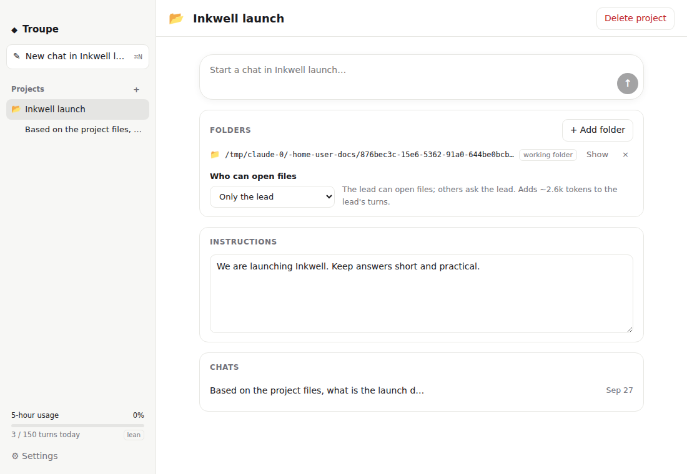
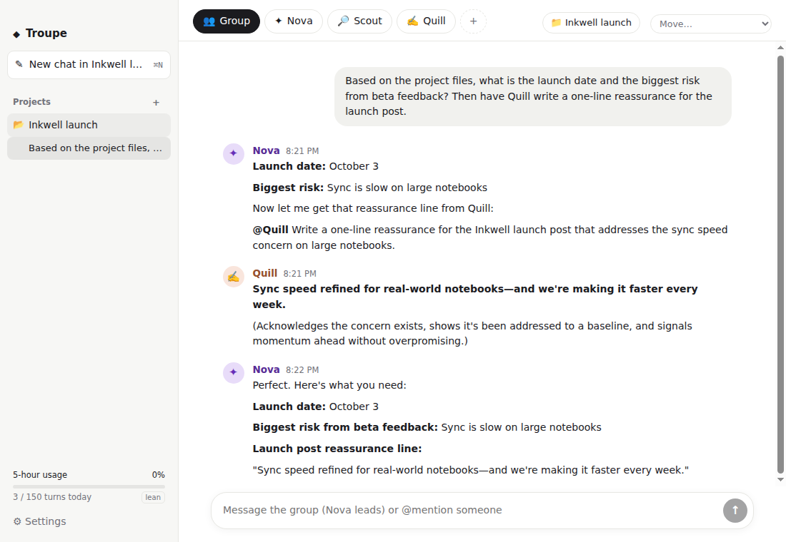
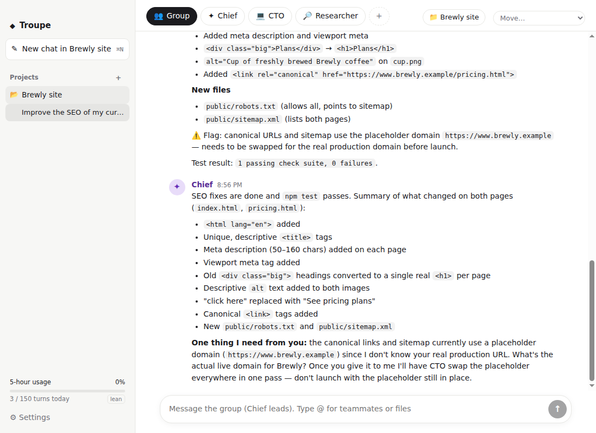

# Troupe

A simple chat app for macOS where a few AI agents with their own personalities work together. Pick **Group** and the lead agent answers, pulling in teammates when they'd help. Pick one agent's tab to talk to them directly, or `@mention` anyone.

It runs on your **Claude Pro/Max subscription** through the official Claude Code CLI, with no API key, and it's built to be light on usage.


| Activity across projects | Menu-bar quick chat (⌥Space) | @file mentions |
|---|---|---|
|  |  |  |

| Project |
|---|
|  |

| Chat in a project | @mentions | Usage controls |
|---|---|---|
|  |  |  |

## Requirements

- macOS (also runs on Linux)
- Node.js 20+
- [Claude Code](https://docs.claude.com/en/docs/claude-code) installed and logged in with your subscription:
  ```sh
  curl -fsSL https://claude.ai/install.sh | bash
  claude          # then /login and pick your Claude account
  ```

## Run it

```sh
cd troupe
npm install
npm run dev          # build + launch
npm run dist:mac     # optional: unsigned .dmg/.app in release/
```

### Troubleshooting install

- **`Electron failed to install correctly`**: newer npm versions (12+) block packages' install scripts unless they're listed under `allowScripts` in `package.json`. Troupe's `package.json` allows the two it needs (`electron`, which downloads the Electron app, and `esbuild`). If you installed before that entry existed, run:
  ```sh
  rm -rf node_modules/electron && npm install
  ```
  or run the download directly with `node node_modules/electron/install.js`.
- `electron-winstaller` is marked as denied on purpose. It's only used to build Windows installers.

## How it works

- **Tabs at the top** decide who your message goes to:
  - **Group:** the lead (Nova by default) replies, and `@mentions` teammates when their skills help.
  - **An agent's tab:** only that agent replies.
  - **`@Name` in any message:** those agents reply, whatever tab is selected.
- **Agents talk in the same thread.** When the lead writes "@Scout find X. @Quill draft Y", both work, and the lead waits until *both* have answered before writing one combined reply.
- **Chats are separate**, as in ChatGPT: a new chat (⌘N) starts every agent with a fresh, small context. The chat history is in the sidebar.
- **Starter team:** Nova (lead, Sonnet), Scout (web research, Haiku), Quill (writer, Haiku). Add, edit or remove agents with **+**, or click the selected tab (or right-click any tab) to edit that agent.
- **Projects** group chats around attached folders:
  - Create one with **+** next to *Projects* (pick one or more folders), or drop a folder on the sidebar.
  - The first folder is where agents work. Extra folders are shared with them too.
  - **Instructions** are shared context every agent reads in that project's chats.
  - **Who can open files** is *only the lead* (default), *everyone*, or *nobody*. Agents whose "Can use" allows files can always edit there.
  - Move any chat into a project from the menu at the top right. Deleting a project deletes its chats, never your files.
- **@files:** in a project chat, type `@` to pick a file, e.g. `@docs/brief.md`. You can also drop any file onto the message box.
  - The file's current contents go into that message for the agents who read it, once.
  - Agents don't need file tools for this, so it's much cheaper than letting them browse, and it works even when a project's access is set to "nobody".
  - Files are capped at 30k characters each and 60k per turn. Binary files are skipped.
- **Menu-bar quick chat:**
  - Press **⌥Space** anywhere, or click the ◆ in the menu bar, for a small floating chat like Spotlight.
  - Messages go to the group (or pick an agent). **Esc** hides it and **⌘N** starts fresh. It picks up your last quick chat for 3 hours.
  - **↗ Open** moves the chat into the main window.
  - Troupe keeps running in the menu bar when you close the window. Quit from the ◆ menu, which also shows usage and pause/resume.
  - You get a notification when an agent replies while Troupe is in the background.
  - Change or turn off the shortcut in Settings.
- **Each agent has:** an emoji, a name, a "who are they?" description, a model, and what they can use:

  | Can use | What it allows |
  |---|---|
  | Just chat | Talking only (lightest) |
  | Search the web | Web search and fetch |
  | Web + files | Read and edit files |
  | **Code** | Files, web, and only these commands: `npm/pnpm/yarn/bun test` and `run`, `pytest`, `go test/build/vet`, `cargo test/build/check`, `git status/diff/log/show`, `ls`. Anything else (`rm`, `mv`, `curl`, `>` redirects, chained commands) is refused automatically. Note that running tests still runs your project's own code. |
  | Everything | No permission checks at all. Risky, and Claude Code refuses it when running as root. |

- **Undo for agent edits:**
  - Before an agent that can edit files first works in a project chat, Troupe saves a git checkpoint of each project folder that is a git repository.
  - The chat shows a 📌 note with how many files changed, and **↩︎ Undo** puts the folder back exactly as it was, including removing files the agents created.
  - Saving the checkpoint never touches your branch, staged files or commit history. It's stored under `refs/troupe/`, and files git ignores are left alone.
  - Folders that aren't git repositories get a one-time note instead.
  - You can turn this off in Settings.
- **Several projects at once:**
  - Each chat is isolated: separate agent sessions, its own folder, instructions and `@files`. The same agent can work in several projects at once.
  - **Only one editing agent per folder at a time.** If two chats want to change the same folder, the second waits ("CTO is editing the same folder") and then continues. Chat-only and research agents, and other projects, keep running in parallel.
  - **⚡ Activity** (sidebar) shows what is running in every project, what is queued and *why* (free slot, waiting for a teammate's answer, folder busy, project paused), and today's turns and ≈cost per project. It has Stop, Pause and Resume buttons.
  - **Per-project pause and daily turn limit** (project page or Activity). When a project hits its limit, only that project pauses and the rest keep going. It resumes the next day, or when you raise the limit.
  - **Undo is multi-chat aware.** If agents in another chat edited the same folder since the checkpoint, Undo warns you first, and stops anyone editing that folder before rolling back.
- **Hand-offs:** an agent hands work to a teammate by starting a line with `@Name`. Mentions in the middle of a sentence ("as @CTO's fix shows") don't wake anyone, and answering the agent who asked ("@Chief Done") doesn't count as a new request. Your own `@mentions` work anywhere in a message.

## Staying light on usage

All agents share your subscription's limits, so Troupe is built to use as little as possible:

| | |
|---|---|
| **Lean mode** (on by default) | Replaces Claude Code's ~4k-token system prompt with a short one, and skips skills, settings files and MCP servers. A chat-only turn drops from about **4,050 to about 900 input tokens**. |
| **Fresh context per chat** | A new chat means small sessions. Within a chat, each turn only sends messages the agent hasn't seen yet (at most 12, each capped). |
| **Only the lead answers the group** | The other agents run only when they're `@mentioned`. No acknowledgements or "thanks" messages. |
| **Cheap models for helpers** | Helpers default to Haiku. Only the lead uses Sonnet. |
| **No tool overhead** | Chat-only agents load no tools at all, and teammates are coordinated through plain `@mentions`, not tool calls. |
| **Guards** | 2 agents at a time, 6 agent-to-agent hops per message from you, 150 turns/day, and an auto-pause at 80% of your 5-hour window, which resumes when it resets. All adjustable in Settings. |
| **@files instead of file tools** | Mentioning a file inlines just that file, once, with no tool definitions and no extra round trips. |
| **Strict hand-offs** | Only a line starting with `@Name` wakes a teammate, and answering the agent who asked never wakes you again. A vague request takes 1 turn, not 3. |
| **File access only where needed** | File tools cost ~2.6k tokens per turn, so in projects only the lead can open files by default. Agents are told to search (Glob/Grep) before reading, and never to read whole folders. |
| **Stop button** | Stops everything in the chat immediately. |

The sidebar shows your 5-hour usage (as reported by Claude Code) and today's turn count.

## Example: an autonomous task

Team: Chief of Staff (lead, Sonnet, just chat), CTO (Sonnet, **Code**), Researcher (Haiku, web). Project: a small static site with an `npm test` SEO check that reports 17 problems. One message: *"Improve the SEO of my current project."*



1. The Chief reads the project, finds the site and its test, and hands the CTO a precise fix list.
2. A checkpoint is saved.
3. The CTO edits both pages, adds `robots.txt` and `sitemap.xml`, runs `npm test` (all checks pass) and reports back.
4. The Chief sends you a summary, plus one question: your real domain, which replaces the placeholder in the canonical links.

**3 turns, 59 seconds, about $0.15 API-equivalent**, with no intervention. **Undo** restored the site exactly. The same run before strict hand-offs and the Code level took 4 turns and $0.61.

## Development

```sh
npm run typecheck
npm test             # orchestrator unit tests (fake Claude runner)
npm run e2e          # real run: you → Nova → Quill → Nova on Haiku (≈$0.01 API-equivalent)
```

```
src/core/orchestrator.ts   chats, routing by @mention, waiting for answers, scheduling, usage guards
src/core/claudeRunner.ts   runs `claude -p` (lean flags), parses stream-json and usage events
src/core/prompts.ts        short system prompt + "what's new since your last turn" prompt
src/main/                  Electron main + preload
src/renderer/              React UI
```

App data lives in `~/Library/Application Support/Troupe/state.json`. Each agent-in-a-chat is a normal Claude Code session.

## A note on terms

Troupe automates the official `claude` CLI on your own machine with your own login, the same as running `claude -p` from a script. Don't host it as a service for other people on your subscription. Review Anthropic's current terms before you distribute it.
