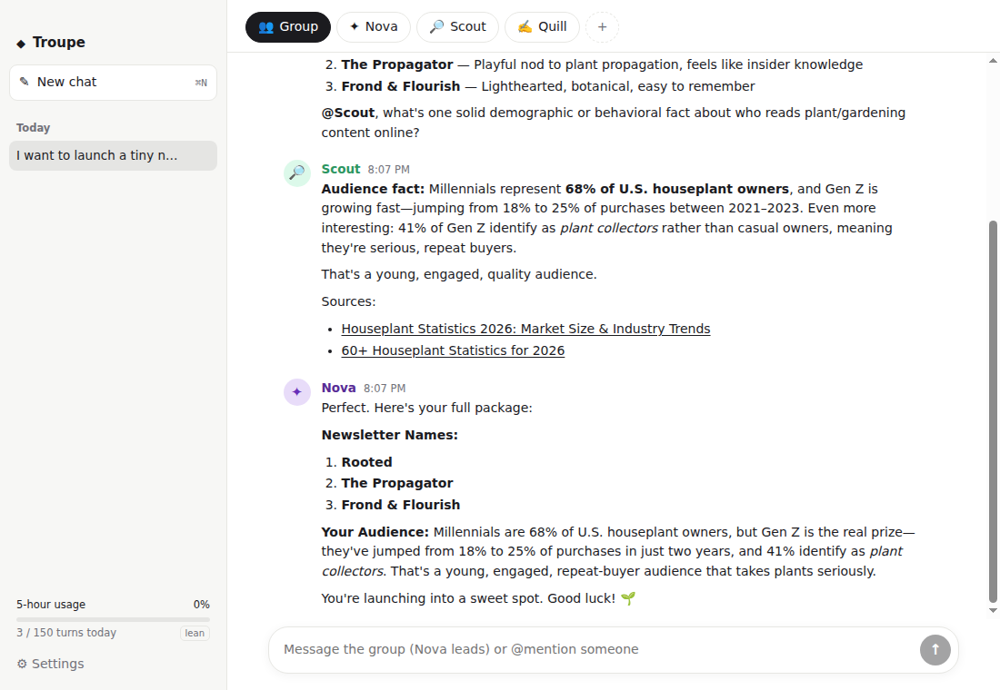
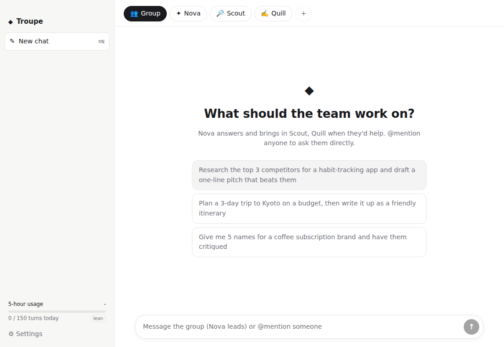
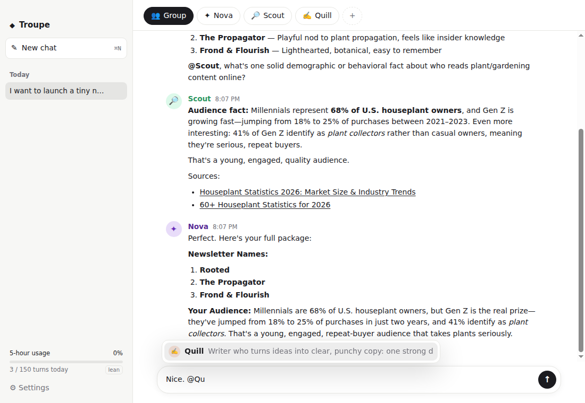
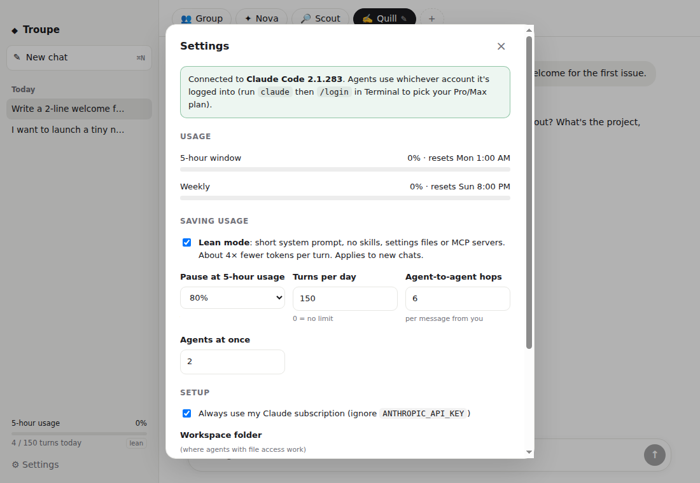

# Troupe

A simple chat app for macOS where a few AI agents with their own personalities work together. Pick **Group** and the lead agent answers, pulling in teammates when they'd help. Pick one agent's tab to talk to them directly, or `@mention` anyone.

It runs on your **Claude Pro/Max subscription** through the official Claude Code CLI, with no API key, and it's built to be light on usage.



| New chat | @mentions | Usage controls |
|---|---|---|
|  |  |  |

## Requirements

- macOS (also runs on Linux)
- Node.js 20+
- [Claude Code](https://docs.claude.com/en/docs/claude-code) installed and logged in with your subscription:
  ```sh
  curl -fsSL https://claude.ai/install.sh | bash
  claude          # then /login and pick your Claude account
  ```

## Run it

```sh
cd troupe
npm install
npm run dev          # build + launch
npm run dist:mac     # optional: unsigned .dmg/.app in release/
```

## How it works

- **Tabs at the top** decide who your message goes to:
  - **Group:** the lead (Nova by default) replies, and `@mentions` teammates when their skills help.
  - **An agent's tab:** only that agent replies.
  - **`@Name` in any message:** those agents reply, whatever tab is selected.
- **Agents talk in the same thread.** When the lead writes "@Scout find X. @Quill draft Y", both work, and the lead waits until *both* have answered before writing one combined reply.
- **Chats are separate**, as in ChatGPT: a new chat (⌘N) starts every agent with a fresh, small context. The chat history is in the sidebar.
- **Starter team:** Nova (lead, Sonnet), Scout (web research, Haiku), Quill (writer, Haiku). Add, edit or remove agents with **+**, or click the selected tab (or right-click any tab) to edit that agent.
- **Each agent has:** an emoji, a name, a "who are they?" description, a model, and what they can use. Options are just chat, web search, files in a workspace folder, or everything.

## Staying light on usage

All agents share your subscription's limits, so Troupe is built to use as little as possible:

| | |
|---|---|
| **Lean mode** (on by default) | Replaces Claude Code's ~4k-token system prompt with a short one, and skips skills, settings files and MCP servers. A chat-only turn drops from about **4,050 to about 900 input tokens**. |
| **Fresh context per chat** | A new chat means small sessions. Within a chat, each turn only sends messages the agent hasn't seen yet (at most 12, each capped). |
| **Only the lead answers the group** | The other agents run only when they're `@mentioned`. No acknowledgements or "thanks" messages. |
| **Cheap models for helpers** | Helpers default to Haiku. Only the lead uses Sonnet. |
| **No tool overhead** | Chat-only agents load no tools at all, and teammates are coordinated through plain `@mentions`, not tool calls. |
| **Guards** | 2 agents at a time, 6 agent-to-agent hops per message from you, 150 turns/day, and an auto-pause at 80% of your 5-hour window, which resumes when it resets. All adjustable in Settings. |
| **Stop button** | Stops everything in the chat immediately. |

The sidebar shows your 5-hour usage (as reported by Claude Code) and today's turn count.

## Development

```sh
npm run typecheck
npm test             # orchestrator unit tests (fake Claude runner)
npm run e2e          # real run: you → Nova → Quill → Nova on Haiku (≈$0.01 API-equivalent)
```

```
src/core/orchestrator.ts   chats, routing by @mention, waiting for answers, scheduling, usage guards
src/core/claudeRunner.ts   runs `claude -p` (lean flags), parses stream-json and usage events
src/core/prompts.ts        short system prompt + "what's new since your last turn" prompt
src/main/                  Electron main + preload
src/renderer/              React UI
```

App data lives in `~/Library/Application Support/Troupe/state.json`. Each agent-in-a-chat is a normal Claude Code session.

## A note on terms

Troupe automates the official `claude` CLI on your own machine with your own login, the same as running `claude -p` from a script. Don't host it as a service for other people on your subscription. Review Anthropic's current terms before you distribute it.
